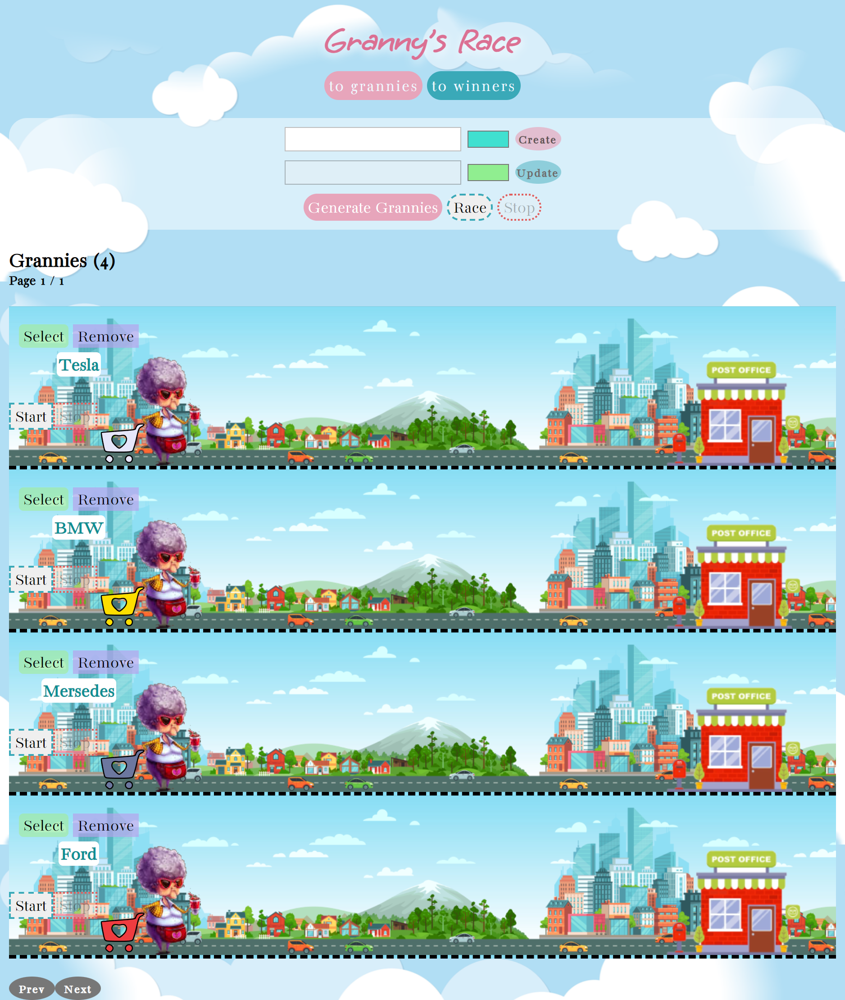

# grannys-race (needs clone repository)

### Description

The **grannys-race** is a  two-paged simulated race SPA based on communication with a server (fetch, REST API). 

It's a "granny's race" with one winner and updated & sorted winners table(best time(the best recorded), number of wins). 

It has a pagination, ability to create/delete/change selected granny, run and stop the race.               

## Getting Started

### Steps

1. Install [Node.js](https://nodejs.org/ru)   

2. Clone [repository](https://github.com/Sandrainporto/grannys-race.git)
3. Run `npm install` (installs dependencies in the root folders)
4. Run `npm run server` (runs server with data needed)
5. Run `npm run start` (starts application by running the bundle on `https://localhost:8080` )

### Stack

- Language: [Typescript](https://www.typescriptlang.org/)  

- Code Formatter: [Prettier](https://prettier.io/) 
- Bundler: [Webpack](https://webpack.js.org/)  

- [ESLint](https://eslint.org/)   
- The application is a [Single Page Application](https://developer.mozilla.org/en-US/docs/Glossary/SPA) with an empty index.html

